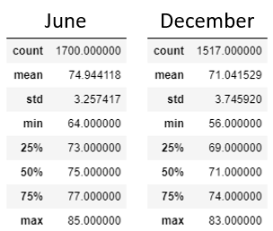

# Surfs Up Weather Analysis

## Overview
The purpose of our analysis is to examine temperature trends in Oahu to determine whether a combined surf and ice cream shop has the potential to be a profitable business year-round.

## Results

The summary statistics for the months we examined are shown below: 

- The average temperature during December is 71°F, approximately 4° lower than the average temperature during June of 75°F. 
- While statistically speaking the difference between the two data sets is significant, the actual difference between the temperatures is relatively small. 
- The interquartile range is 69°F-74°F in December, meaning that less than 25% of the temperature readings fall below 69°F. 

## Summary

This analysis showed that there is not much variation between temperatures in June and December in Oahu and that the temperate climate would be ideal for a combined surf and ice cream shop. Additional queries that we could perform to provide better insights include:
1. Filtering the temperature measurements by time to show only the daytime temperature readings.
2. Filtering the stations to show only readings taken near the intended shop location.
